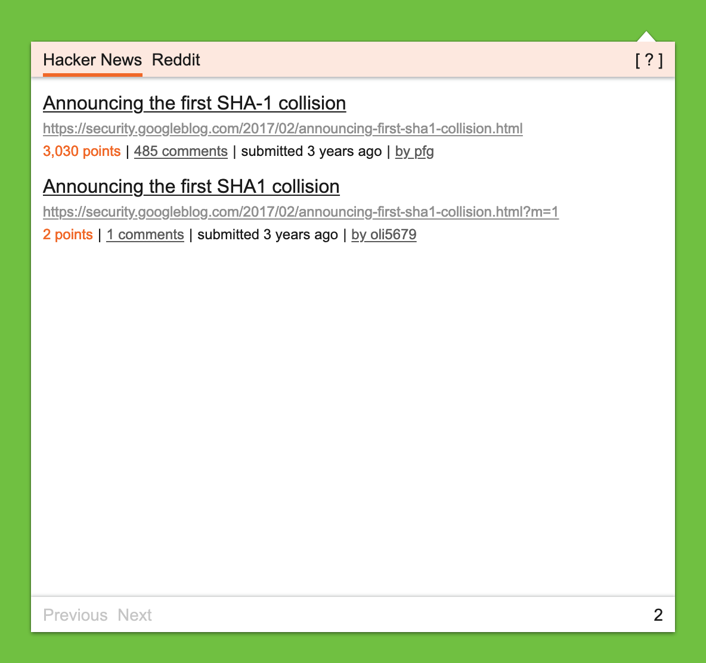
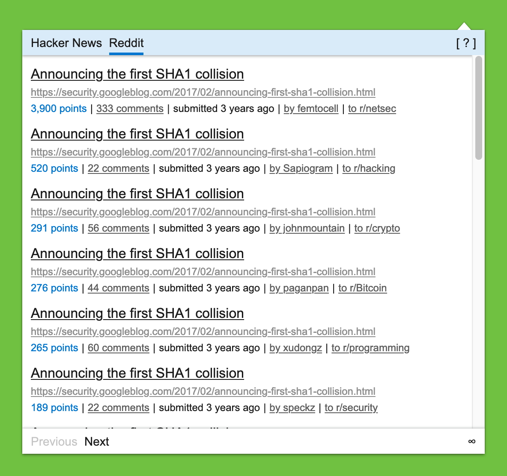
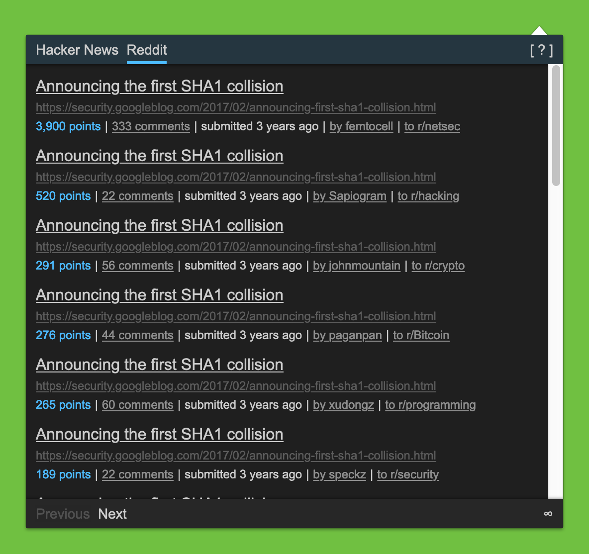

# Tolon Browser Extension

[
](https://github.com/rwanyoike/tolon-browser-extension/actions/workflows/nodejs-package.yml?query=branch%3Amain)
[
](LICENSE.txt)
[](https://chrome.google.com/webstore/detail/tolon/mohaijbbfgjjjjbhffgaifcnookdihmk)
[](https://addons.mozilla.org/en-US/firefox/addon/tolon-browser-extension)

> Find webpage discussions on the web. (e.g. Hacker News, Reddit)

Tolon (토론) is a browser extension that helps you find discussions around the pages you're looking at on the web. It works by searching [available sources](#usage) for URL submissions.

[Installation](#installation) | [Usage](#usage) | [Attribution](#attribution) | [Contributing](#contributing) | [License](#license) | [Similar Extensions](#similar-extensions)

|  |  |
| ------------------------------------- | ------------------------------------- |
|  |  |

## Installation

These are the extension's [permissions](public/manifest.json):

```json
"permissions": [
  "activeTab"
]
```

**activeTab**:

This is necessary to be able to:

- Find out which tab is currently active.
- Query the webpage URL.

### Chromium

[](https://chrome.google.com/webstore/detail/tolon/mohaijbbfgjjjjbhffgaifcnookdihmk)

You can install the latest version from the [Chrome Web Store](https://chrome.google.com/webstore/detail/tolon/mohaijbbfgjjjjbhffgaifcnookdihmk). It's expected that the extension is compatible with any Chromium-based browsers.

### Firefox

[](https://addons.mozilla.org/en-US/firefox/addon/tolon-browser-extension)

You can install the latest version from the [Firefox Add-ons](https://addons.mozilla.org/en-US/firefox/addon/tolon-browser-extension) web site.

### npm Build

```shell
git clone https://github.com/rwanyoike/tolon-browser-extension.git
cd tolon-browser-extension
npm install
npm run build
```

Find the compiled browser extension under `dist/`.

## Usage

While viewing a webpage, opening the extension will search available sources for URL submissions (discussion threads) and present a list of results.

Available sources:

- [Hacker News](https://news.ycombinator.com)
- [Reddit](https://www.reddit.com)
- [Sample Site](src/sources/sample-site/index.ts) (template)

## Attribution

- Icon by [Asier Bilbo](https://thenounproject.com/creator/asierbilbo) from Noun Project.

## Contributing

Pull requests are welcome. For major changes, please open an issue first to discuss what you would like to change.

## License

This project is licensed under the [MIT License](./LICENSE.txt).

## Related Projects

- [Discussed Elsewhere](https://github.com/jsuar/discussed-elsewhere)
- [Newsit](https://github.com/benwinding/newsit)
